# Rd_AP2 

Modern fintech payment platform based on Google Cloud ecosystem and X402 protocol.

## System Architecture

```mermaid
flowchart TD
    subgraph UserLayer["User Layer"]
        U1["End User"]
        U2["Administrator"]
        U3["Partner"]
    end

    subgraph NetworkLayer["Google Cloud Network Layer"]
        GATEWAY["Gateway API"]
        CDN["Cloud CDN"]
        WAF["Cloud Armor"]
        DNS["Cloud DNS"]
    end

    subgraph GKELayer["GKE Autopilot Cluster"]
        subgraph AppNamespace["rd-ap2 Namespace"]
            API["FastAPI Backend"]
            AGENT["AI Agent Service"]
        end

        subgraph SystemServices["System Services"]
            INGRESS["Ingress Controller"]
            CERT_MGR["Cert Manager"]
            EXTERNAL_DNS["External DNS"]
        end
    end

    subgraph ServerlessLayer["Serverless Services"]
        WEBHOOK["Webhook Handler"]
        SCHEDULER["Scheduler"]
        BATCH["Batch Jobs"]
        WORKFLOWS["Workflows"]
    end

    subgraph DataLayer["Google Cloud Data Layer"]
        subgraph RelationalDB["Relational Database"]
            SQL_MAIN["Cloud SQL"]
            SQL_REPLICA["Read Replica"]
        end

        subgraph NoSQLCache["NoSQL & Cache"]
            FIRESTORE["Firestore"]
            MEMORYSTORE["Memorystore Redis"]
            BIGTABLE["Bigtable"]
        end

        subgraph ObjectStorage["Object Storage"]
            GCS_MODEL["Model Storage"]
            GCS_CATALOG["Catalog Storage"]
            GCS_LOGS["Log Archive"]
        end

        subgraph DataAnalytics["Data Analytics"]
            BIGQUERY["BigQuery"]
            DATAPROC["Dataproc"]
            DATAFLOW["Dataflow"]
        end
    end

    subgraph AILayer["Vertex AI Services"]
        GEMINI["Gemini Model"]
        VECTOR_SEARCH["Vector Search"]
        MATCHING_ENGINE["Matching Engine"]
        PIPELINES["AI Pipelines"]
        NOTEBOOKS["Notebooks"]
        MODEL_REGISTRY["Model Registry"]
    end

    subgraph PaymentLayer["Payment Services"]
        subgraph X402Protocol["X402 Payment Protocol"]
            X402_PROTOCOL["X402 Protocol"]
            HKDR_SERVICE["HKDR Stablecoin"]
            FACILITATOR["Facilitator Service"]
        end

        subgraph BlockchainNetwork["Blockchain Network"]
            BLOCKCHAIN_NETWORK["Blockchain Network"]
        end

        subgraph WalletIntegration["Wallet Integration"]
            BLOCKCHAIN_WALLET["Blockchain Wallet"]
        end

        subgraph RiskCompliance["Risk & Compliance"]
            RISK_ENGINE["Risk Engine"]
            FRAUD_DETECTION["Fraud Detection"]
            AML_COMPLIANCE["AML Compliance"]
            KYC_VERIFICATION["KYC Verification"]
        end
    end

    subgraph SecurityLayer["Security & Identity"]
        IAM["Cloud IAM"]
        SECRETS["Secret Manager"]
        KMS["Cloud KMS"]
        WORKLOAD_ID["Workload Identity"]
        VPC_SC["VPC Service Controls"]
        BINARY_AUTH["Binary Authorization"]
    end

    subgraph MonitoringLayer["Monitoring & Operations"]
        LOGGING["Cloud Logging"]
        MONITORING["Cloud Monitoring"]
        TRACE["Cloud Trace"]
        PROFILER["Cloud Profiler"]
        ERROR["Error Reporting"]
        UPTIME["Uptime Checks"]
        ALERTING["Alerting"]
    end

    subgraph CICDLayer["CI/CD Pipeline"]
        BUILD["Cloud Build"]
        ARTIFACT["Artifact Registry"]
        DEPLOY["Cloud Deploy"]
        SCAN["Container Analysis"]
        TERRAFORM["Terraform"]
        CONFIG_SYNC["Config Sync"]
    end

    %% Connection Relationships
    U1 --> GATEWAY
    U2 --> GATEWAY
    U3 --> GATEWAY

    GATEWAY --> INGRESS
    INGRESS --> API

    API --> AGENT

    AGENT --> GEMINI
    AGENT --> VECTOR_SEARCH
    AGENT --> MATCHING_ENGINE

    %% Payment Service Connections
    API --> X402_PROTOCOL
    X402_PROTOCOL --> HKDR_SERVICE
    HKDR_SERVICE --> FACILITATOR
    FACILITATOR --> BLOCKCHAIN_NETWORK
    HKDR_SERVICE --> RISK_ENGINE
    RISK_ENGINE --> FRAUD_DETECTION
    FRAUD_DETECTION --> AML_COMPLIANCE
    AML_COMPLIANCE --> KYC_VERIFICATION

    %% Wallet Connections
    U1 --> BLOCKCHAIN_WALLET
    BLOCKCHAIN_WALLET --> X402_PROTOCOL

    API --> SQL_MAIN
    API --> FIRESTORE
    API --> MEMORYSTORE

    WEBHOOK --> API
    SCHEDULER --> BATCH
    BATCH --> BIGTABLE

    SQL_MAIN --> SQL_REPLICA
    SQL_REPLICA --> BIGQUERY

    FIRESTORE --> GCS_LOGS
    GEMINI --> GCS_MODEL
    MATCHING_ENGINE --> GCS_CATALOG

    WORKLOAD_ID --> IAM
    SECRETS --> KMS

    API --> LOGGING
    AGENT --> LOGGING

    LOGGING --> MONITORING
    MONITORING --> ALERTING

    BUILD --> ARTIFACT
    ARTIFACT --> DEPLOY
    DEPLOY --> INGRESS

    SCAN --> ARTIFACT
    TERRAFORM --> IAM
```

## Key Features

- **AI-Powered Risk Assessment**: Google ADK + Vertex AI Gemini
- **Modern Payment Architecture**: X402 protocol + HKDR stablecoin
- **Google Cloud Integration**: GKE Autopilot + Full CI/CD pipeline
- **Enterprise Security**: IAM, Secret Manager, KMS, Workload Identity
- **Comprehensive Monitoring**: Logging, Monitoring, Trace, Error Reporting

## Tech Stack

- **Cloud**: Google Cloud Platform (40+ services)
- **Backend**: FastAPI (Python)
- **AI/ML**: Google ADK, Vertex AI
- **Payment**: X402 Protocol, HKDR Stablecoin
- **Blockchain**: Multiple network support
- **Infrastructure**: Terraform, Kubernetes, Docker

## Quick Start

## License

MIT License - see [LICENSE](LICENSE) file for details.
